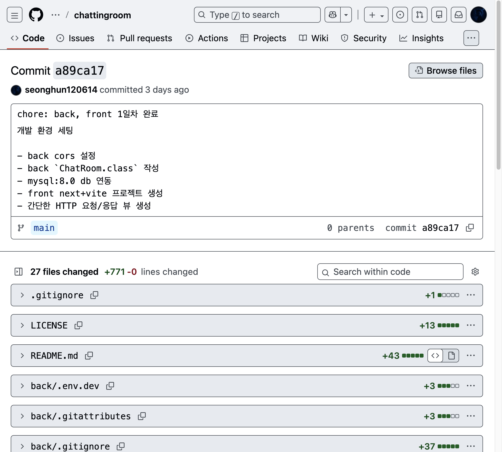
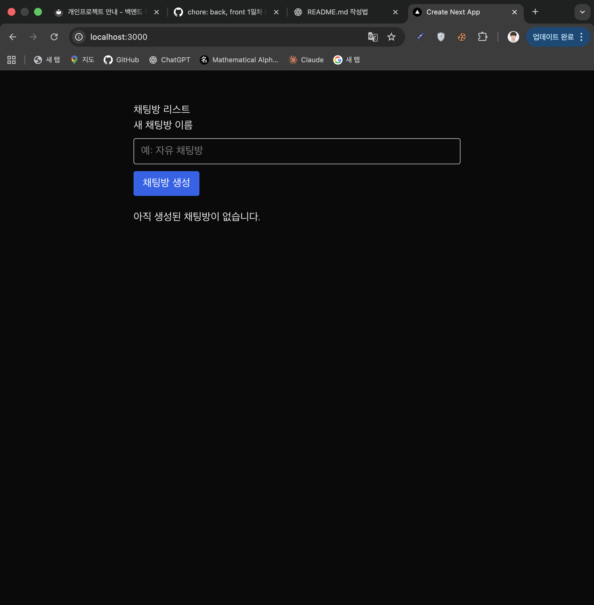
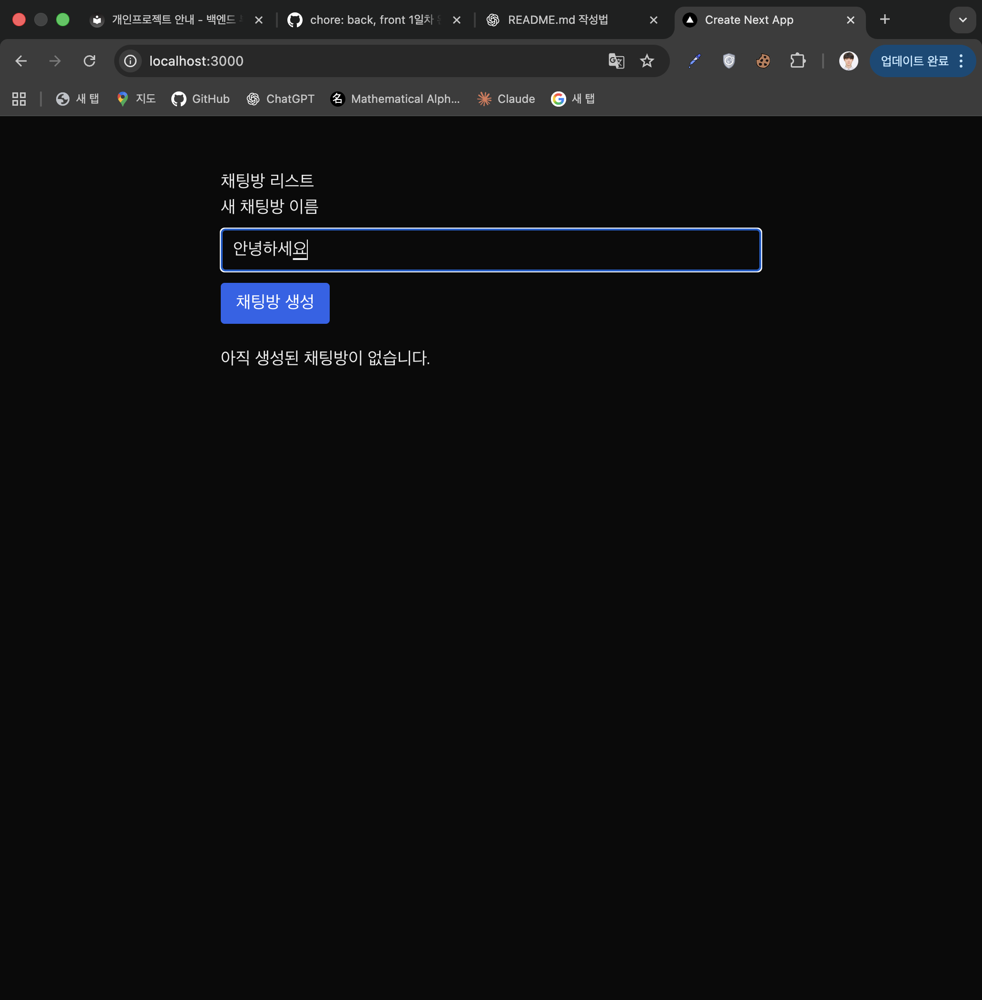
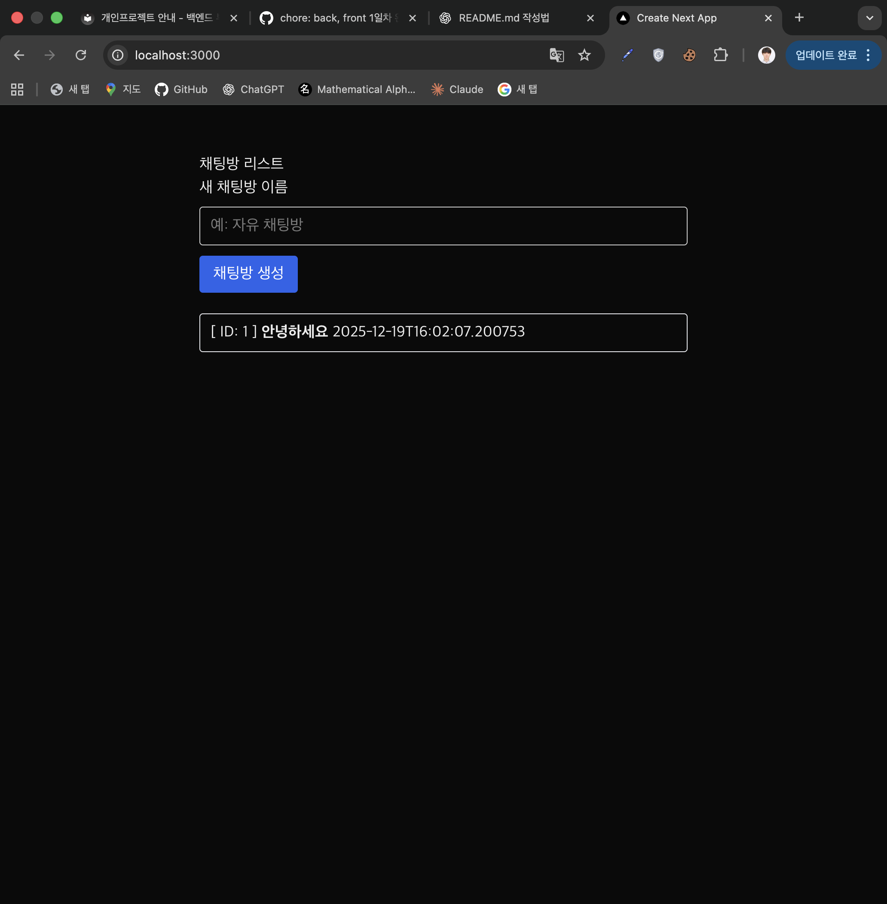
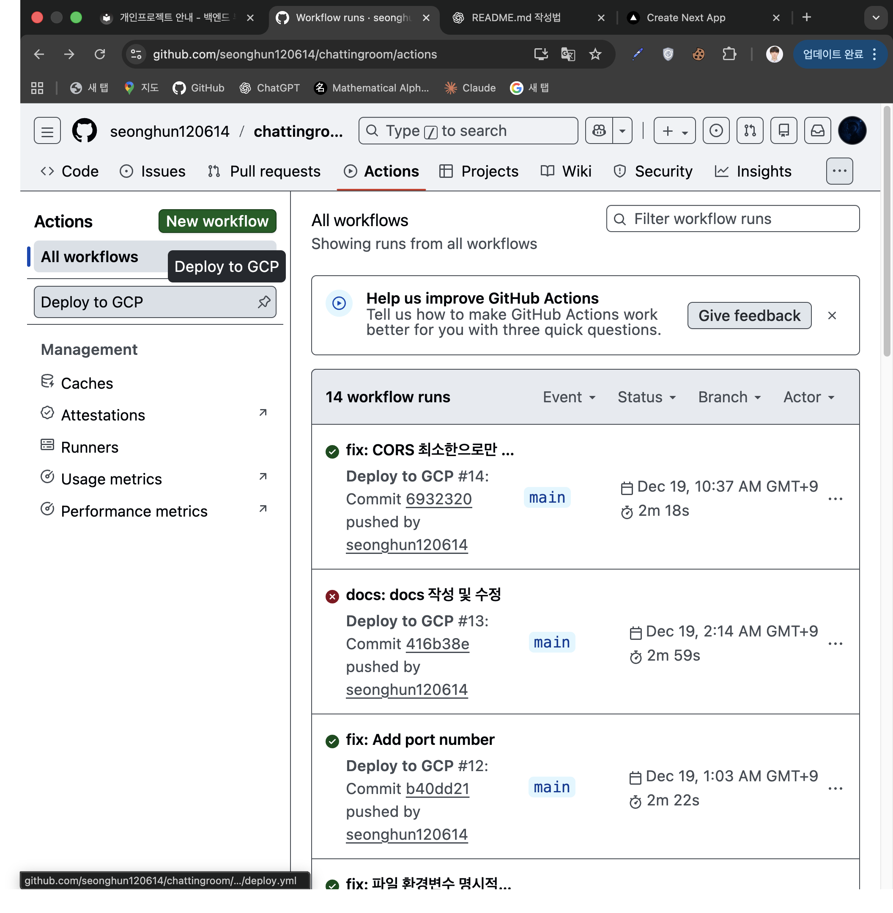

# Chatting Room

간단한 채팅방 생성만 구현한 간단한 웹 서비스 실습 프로젝트

### Overview

이 프로젝트는 본 프로젝트 이전에 팀 프로젝트에서 뒤쳐지지 않기 위해 공부를 위한 프로젝트입니다.

### Tech Stack

| 구분 | 기술 스택 |
|---|---|
| 프론트엔드 | Next.js (JavaScript) + TailwindCSS |
| 백엔드 | Spring Boot |
| 데이터베이스 | MySQL |
| 컨테이너 | Docker, Docker Compose |
| 배포 | AWS EC2 혹은 GCP VM |
| 자동화 | GitHub Actions |

### API 명세

다음 참고

[02-api-spec](./docs/02-api-spec.md)

### 디렉토리 구조

```text
├── back
│   ├── Dockerfile.dev
│   ├── build
│   ├── build.gradle
│   ├── docker-compose.dev.yml
│   ├── gradle
│   ├── gradlew
│   ├── gradlew.bat
│   ├── settings.gradle
│   └── src
├── docker-compose.dev.yml
├── docker-compose.yml
├── docs
└── front
    ├── Dockerfile.dev
    ├── app
    ├── eslint.config.mjs
    ├── jsconfig.json
    ├── next.config.mjs
    ├── node_modules
    ├── package-lock.json
    ├── package.json
    ├── postcss.config.mjs
    └── public
```

### 실행 방법

**개발 환경 - back**
```bash
cd back

docker compose -f docker-compose.dev.yml up --build
```

**개발 환경 - front**
```bash
cd front

docker build -f Dockerfile.dev -t chatting-next:1.0 .
docker run --rm -p 3000:3000 chatting-next:1.0
```

**개발 환경 - 시스템 전체**
```bash
docker compose -f docker-compose.dev.yml up --build
```

**배포 CI/CD**

VM 의 host(External IP) 를 가지고 다음 환경변수를 세팅

```md
**DB 설정 정보**
MYSQL_DATABASE=
MYSQL_USER=
MYSQL_PASSWORD=
MYSQL_ROOT_PASSWORD=

**Back 설정 정보**
SPRING_DATASOURCE_USER=
SPRING_DATASOURCE_PASSWORD=
SPRING_DATASOURCE_URL=
CORS_ALLOWED_ORIGIN=

**Docker Hub Image 가져오기 위한 로그인**
DOCKER_USERNAME=
DOCKER_PASSWORD=

**GCP 접속 위함**
GCP_APP_PATH=
GCP_SSH_KEY=
GCP_USERNAME=
GCP_HOST=
```

위 정보를 git secrets 쪽에 입력 후 main 브랜치로의 `git push` 시 동작

**주의**
- VM 이 돌아가고 있는지 확인해야 함
- VM 의 방화벽에 22, 3000, 8080 번 TCP 포트를 막고 있는지 확인

### Troubleshooting

다음 참고

[06-retrospective.md](./docs/06-retrospective.md)

### 산출물 체크

##### 1일차 산출물

- [O] GitHub 리포지토리 생성 및 코드 Push
- [O] Backend/Frontend 폴더 분리



- [O] 로컬에서 데이터 저장/조회 성공 스크린샷








- [O] API 명세서 작성 ([docs/02-api-spec.md](./docs/02-api-spec.md))

##### 2일차 산출물

- [O] 로컬에서 docker-compose up 실행 확인(1일차 참고)
- [O] Dockerfile 2개 작성 ([Backend](./back/Dockerfile.dev), [Frontend](./front/Dockerfile.dev))
- [O] [docker-compose.yml](./docker-compose.yml) 작성

---

- [O] AWS EC2에 수동 배포 성공
- [O] EC2 IP 주소로 서비스 접속 확인

위 2개는 다음을 참고

[03-docker.md](./docs/03-docker.md)  
[04-deploy.md](./docs/04-deploy.md)

##### 3일차 산출물

[O] [GitHub Actions](./.github/workflows/deploy.yml) 워크플로우 파일 작성
[O] 코드 수정 후 Push → 자동 배포 확인



[O] 모든 문서 작성 완료
[O] [회고 문서](./docs/06-retrospective.md) 작성

### LICENSE

[Apache License](LICENSE) Copyright (c) 2024 seonghun