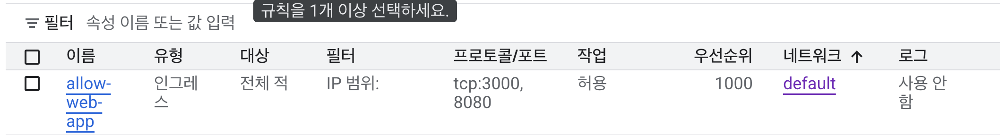

# GCP 배포 설명

## 1. GCP VM 을 선택한 이유

AWS 를 과거에도 써봤지만, UI/UX 가 굉장히 안좋고, 분명 선택할 때는 `free-tier` 로 되어 있던거 같은데 너무 빨리 소진되어 과금이 되었다.

다만 GCP 는 UI/UX 가 전반적으로 깔끔하며, 무료로 쓸 때도 쓸 수 있는 기능들이 굉장히 많고, 이전에도 GCP 를 써왔기 때문에 익숙했다.

## 2. 보안 그룹/보안 포트 설정

> 이전에 이미 열어놨던 port 를 제외하고 말씀드립니다.



**TCP 프로토콜**
- 3000: Front 전용
- 8080: Back 전용
- 22: 관리자 전용

> DB 서버는 X, 굳이 사용자에게 열어놓는건 불필요, raw data 를 그대로 노출시키는건 보안 상 적절치 않음

## 3. 서버에서 실행한 명령 흐름

다음 링크를 참고합니다.

**[Install Docker Engine on Ubuntu](https://docs.docker.com/engine/install/ubuntu/)**

```bash
# 비공식 패키지 삭제
sudo apt remove $(dpkg --get-selections docker.io docker-compose docker-compose-v2 docker-doc podman-docker containerd runc | cut -f1)

# 도커 공식 GPG 키를 설정
sudo apt update
sudo apt install ca-certificates curl
sudo install -m 0755 -d /etc/apt/keyrings
sudo curl -fsSL https://download.docker.com/linux/ubuntu/gpg -o /etc/apt/keyrings/docker.asc
sudo chmod a+r /etc/apt/keyrings/docker.asc

# Add the repository to Apt sources:
sudo tee /etc/apt/sources.list.d/docker.sources <<EOF
Types: deb
URIs: https://download.docker.com/linux/ubuntu
Suites: $(. /etc/os-release && echo "${UBUNTU_CODENAME:-$VERSION_CODENAME}")
Components: stable
Signed-By: /etc/apt/keyrings/docker.asc
EOF

sudo apt update

# Docker 패키지를 설치
sudo apt install docker-ce docker-ce-cli containerd.io docker-buildx-plugin docker-compose-plugin

# Docker 테스트
sudo systemctl status docker
```

## 4. 배포 후 접속 방식

#### gcloud 이용

```bash
gcloud compute ssh --zone <region> <vm-name> --project <project-id>
```

> gcloud 를 통해 처음 접속 시 비밀번호를 설정 할 수도 있음

#### ssh 이용

```bash
ssh-keygen -t rsa -b 4096 -f ~/.ssh/<key_filename> -C <username>
```

> 사용자 이름은 그냥 설명 용도이다.

```bash
cat ~/.ssh/<key_filename>.pub
```

> 전체 복사를 한다.

**GCP GUI 가이드**
1. VM 인스턴스 수정
2. 아래로 내리다 보면 SSH 키 나옴
3. 위에서 복사한 public key 값 붙여넣기

```bash
ssh -i ~/.ssh/<key_filename> <username>@<external_ip>
```

> `username` 은 VM 에 직접 접속하여 `whoami` 명령어를 쳐서 보거나  
`gcloud compute ssh <vm_name>` 의 명령어를 통해 볼 수 있다.

#### 문제 해결

```bash
# Private key 권한 수정
chmod 600 ~/.ssh/gcp_key

# Public key 권한 수정
chmod 644 ~/.ssh/gcp_key.pub
```